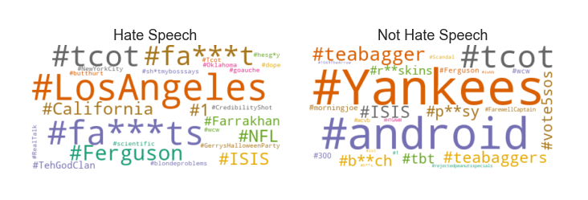
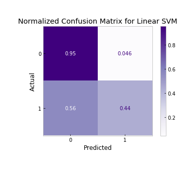
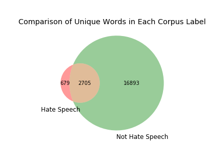

# Twitter Hate Speech Detection
## *Can content moderation be automated?*

#### Project ongoing until January 6

**Please note:** Because of the subject matter of this project, all notebooks contain offensive language from the dataset.

## Overview


## Business Problem
Human content moderation exploits people by consistently traumatizing and underpaying them. In 2019, an [article](https://www.theverge.com/2019/6/19/18681845/facebook-moderator-interviews-video-trauma-ptsd-cognizant-tampa) on The Verge exposed the extensive list of horrific working conditions that employees faced at Cognizant, which was Facebook’s primary moderation contractor. Unfortunately, every major tech company, including Twitter, uses human moderators to some extent, both domestically and overseas.

Hate speech is defined as abusive or threatening speech that expresses prejudice against a particular group, especially on the basis of race, religion or sexual orientation. Usually, the difference between hate speech and offensive language comes down to subtle context or diction. 

Any company with an online forum where users post content could benefit from automating as much as the moderation process as possible. Ultimately, human content moderation is not only detrimental to workers, but also presents a liability to companies that use them.

## Data & Methods
The dataset for this capstone project was sourced from a study called Automated Hate Speech Detection and the Problem of Offensive Language  conducted by Thomas Davidson and a team at Cornell University in 2017. The GitHub repository can be found [here](https://github.com/t-davidson/hate-speech-and-offensive-language). The dataset is provided as a `.csv` file with 24,802 text posts from Twitter where 6% of the tweets were labeled as hate speech. 

Since content moderation is so subjective, the labels on this dataset were crowdsourced and determined by majority-rules. The “class” column labels each tweet as 0 for hate speech, 1 for offensive language or 2 for neither. In order to create a different project and adapt the data to my specific business context, I will be treating the data as a binary classification problem. 

Therefore, the final model will be **predicting whether a tweet is hate speech or not.** To prepare the data for this, I will be manually replacing existing 1 and 2 values as 0, and replacing 0 as 1 to indicate hate speech.

### Cleaned Dataset Columns

| Column Name | Description |
|-|-|
| total_votes | number of CrowdFlower users who coded each tweet (minimum is 3, sometimes more users coded a tweet when judgments were determined to be unreliable by CF). |
| hate_speech_votes | number of CF users who judged the tweet to be hate speech. |
| other_votes | number of CF users who judged the tweet to be offensive language or neither. |
| label | class label for majority of CF user votes. 1 - hate speech 0 - not hate speech |
| tweet | raw tweets |
| clean_tweet | tweets filtered through NLP data cleaning process |

## Data Understanding

### 1. What are the linguistic differences between hate speech and offensive language?


Linguistically, it's important to note that the difference between hate speech and offensive language often comes down to how it targets marginalized communities, often in threatening ways.

Although these graphs have very similar frequently occurring words, there are a few that stand out. For instance, we can notice from this figure that Hate Speech typically contains the N-word with the hard 'R'. **The use of this slur could indicate malicious intent, which goes beyond possibly using the word as slang.**

Examples like that one demonstrate the nuances of English slang and the fine line between Hate Speech and offensive language. **Because of the similarities of each label’s vocabulary, it could be difficult for machine learning algorithms to differentiate between them and determine what counts as hate speech.**

### 2. What are the most popular hashtags of each tweet type?



From these word clouds, we can see some more parallels and differences between what is classified as hate speech or not. For instance, #tcot stands for "Top Conservatives On Twitter” and it appears in both groups. However, #teabagger, which refers to those who identify with the Tea Party, that is primarily (but not exclusively) associated with the Repubclican Party, appears in only the “Not Hate Speech” cloud. Both hashtags are used among Alt-Right communities.

Additionally, the #r**skins hashtag appears in only the Not Hate Speech cloud. This was the former name of the Washington NFL team. Knowing the context, we know that hashtag could certainly include text that constitutes as hate speech. WIth this, and other hashtags that appear in the “Not Hate Speech” cloud, we can clearly see the very slight differences between the two labels.

Besides that, others are simply pop culture references, such as #Scandal the TV show or #vote5sos referring to the boy band. It’s interesting that those contain a lot of offensive language, probably from fan reactions and community conflicts. Ultimately, we can recommend that **Twitter should closely monitor those top hashtags for potential posts containing hate speech** or even regular offensive language.


### 3. What is the overall polarity of the tweets?


The compound polarity score is a metric that calculates the sum of all the [lexicon ratings](https://github.com/cjhutto/vaderSentiment/blob/master/vaderSentiment/vader_lexicon.txt) which have been normalized between -1 and +1. With -1 being extreme negative and +1 being extreme positive. **This score encompasses the overall sentiment of this corpus.**

- Hate Speech tweets on average have a compound score of -0.363
- Non Hate Speech tweets on average have a compound score of -0.263

According to this metric, both classes of tweets have pretty negative sentiments because their normalized compound scores are less than -0.05. 

Additionally from this graph, we can see that tweets classified as Hate Speech are especially negative. This further emphasizes how slim the difference between the two labels are. Although both classes contain negative and offensive language, Hate Speech is much more negative on average.

## Final Model Performance

For this business problem, we will use F1 score as the main metric, while also looking at Precision and Recall. The F1 score finds the harmonic mean between Precision and Recall, and it's useful for data with high class imbalance.

We will also be looking at the weighted F1 score, as it can account for the class imbalance in labels by calculating metrics for each label. It finds their average weighted by support (the number of true instances for each label). This results in a F1 score that is not between precision and recall.

Overall, we want as much hate speech to flagged as possible and so that it can be efficiently removed.




So as expected, the final model has a True Negative Rate of 95% and a True Positive Rate of only 44%.

This is consistent with the final model's evaluation metrics, where it got a Recall of .437, aka the True Negative Rate. In this business context, we would ideally want as many True Negatives as possible, because that would be identifying Hate Speech correctly. Therefore, this is where the final model fails.

Also, we can see that only 4.6% of predictions are False Positives. Which mean that they were classified as "Hate Speech" when it's not. It's great that this amount is low, because site users tend to launch complaint reports when their content is over-flagged as hate speech content when it's not.

Overall, the Recall of this model needs to be greatly improved, in addition to the F1 of .0.3955.

## Conclusion

The final model had an F1 of .3955 and Recall of .437, which isn't much better than random guessing. Although this project had extensive preprocessing and modeling iterations, there is room for improvement.

It's important to understand why the model performed so poorly and how that relates to the business problem. The F1 score was brought down by the "Hate Speech" label predictions. The model was able to predict 95% of the "Not Hate Speech" labels correctly, but it performed poorly for the other label, only able to correctly predict 44%.

This performance is indicative of the two major roadblocks of the project: (1) the class imbalance of the dataset and (2) the model's ability to identify what constitutes as hate speech.

The issue of class imbalance is manageable with preprocessing techniques and oversampling/undersampling techniques. However, identifying hate speech is an overall problem that many major tech companies like Twitter, Facebook and Instagram are still struggling with.

This is because the line between Hate Speech and regular offensive language is so fine. Hate speech is defined as abusive or threatening speech that expresses prejudice against a particular group, especially on the basis of race, religion or sexual orientation. Usually, the difference between hate speech and offensive language comes down to subtle context or diction.



Here, we can see that there are 679 words unique to the "Hate Speech" label. Some of these words are nonsensical or meaningless, but some are especially hateful words. For example, this label contains phrases such as "sp-cs", "mo-kies", "ov-nj-w", "fa--ot" and much more. These are all ethnic or homophobic slurs. Most notably, we saw in earlier EDA that this label disproportionately contains the N-word with the hard "R". Language like this

However, it's hard for a machine learning model to understand the nuances with this hateful slang. Although these words are unique to the "Hate Speech" label corpus, there's simply not enough data for that label. Therefore, an important next step would be to collect more data that has been identified as hate speech by CrowFlow voters.

Additionally, we can recommend for now that Twitter manually moderate these words, just like it could with the top hashtags that were identified for each label in earlier EDA.

Ultimately, automating hate speech detection is an extremely difficult task because of the nuances in English slang and slurs. This project was able to get that process started, but there is much more work to be done to keep this content off of public-facing forums such as Twitter.

## Next Steps

To further develop this project, here are some immediate next steps that anyone could execute.

- Collect more potentialHate Speech data to be labeled by CrowdFlow voting system
- Improve final model with different preprocessing techniques, such as removing offensive language as stop words
- Evaluate model with new tweets or other online forum data to see if it can generalize well
- LDA Topic Modeling with Gensim
- Deploy MVP on Webapp via StreamLit

## Repository Contents
```bash
.
├── models                             # contains model iterations
├── pickle                             # contains cleaned data
├── preprocessing                      # contains all data preperation iterations and EDA notebooks
│   ├── data_cleaning.ipynb            # raw data cleaning notebook
│   ├── eda_notebook.ipynb             # exploratory data analysis notebook
│   └── nlp_preprocessing.ipynb        # feature engineering notebook
├── src                                # source folder
│   └── twitter_data.csv               # raw dataset
├── visualizations                     # contains visualizations and local images
├── presentation.pdf                   # slide deck
├── README.md                          # public-facing preview
└── final_notebook.ipynb               # final version of EDA, feature engineering and modeing process
```

## For More Information

- See the [full project overview](https://github.com/sidneykung/twitter_hate_speech_detection/blob/master/final_notebook.ipynb) in the `final_notebook.ipynb` Jupyter Notebook.

- For additional information or suggestions, contact Sidney Kung at [sidneyjkung@gmail.com](mailto:sidneyjkung@gmail.com)

**Let's connect!**

- [LinkedIn](https://www.linkedin.com/in/sidneykung/)

- [Twitter](https://twitter.com/sidney_k98)

## References

Davidson, T., Warmsley, D., Macy, M. and Weber, I., 2017. Automated Hate Speech Detection and the Problem of Offensive Language. ArXiv,.
