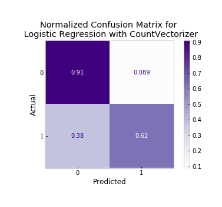

# Twitter Hate Speech Detection

## *Can Content Moderation Be Automated?*


## Overview

This project aims to **automate content moderation** to identify hate speech using **machine learning binary classification algorithms.** Baseline models included Random Forest, Naive Bayes, Logistic Regression and Support Vector Machine (SVM). The final model was a **Logistic Regression** model that used Count Vectorization for feature engineering. It produced an F1 of 0.3958 and Recall (TPR) of 0.624. This performance can be attributed to the massive class imbalance and the model's inability to "understand" the nuances of English slang and slurs. Ultimately, automating hate speech detection is an extremely difficult task. And although this project was able to get that process started, there is more work to be done in order to keep this content off of public-facing forums such as Twitter.

An **interactive version** of the final model is hosted on Heroku. Check it out [here](https://hate-speech-predictor.herokuapp.com/)!

## Business Problem
**Human content moderation exploits people by consistently traumatizing and underpaying them.** In 2019, an [article](https://www.theverge.com/2019/6/19/18681845/facebook-moderator-interviews-video-trauma-ptsd-cognizant-tampa) on The Verge exposed the extensive list of horrific working conditions that employees faced at Cognizant, Facebook’s former moderation contractor. Unfortunately, **every major tech company**, including **Twitter**, uses human moderators to some extent, both domestically and overseas.

Hate speech is defined as **abusive or threatening speech that expresses prejudice against a particular group, especially on the basis of race, religion or sexual orientation.** Usually, the difference between hate speech and offensive language comes down to subtle context or diction. 

**Warning:** All notebooks contain offensive language from the dataset.

## Data Sourcing
The dataset for this capstone project was sourced from a study called *Automated Hate Speech Detection and the Problem of Offensive Language* conducted by Thomas Davidson and a team at Cornell University in 2017. The GitHub repository can be found [here](https://github.com/t-davidson/hate-speech-and-offensive-language). 

- The dataset is a `.csv` file with **24,802** text posts from Twitter where **6% of the tweets were labeled as hate speech**
- The labels on this dataset were voted on by crowdsource and **determined by majority-rules**
- To prepare the data for binary classification, labels were manually replaced by changing existing 1 and 2 values to 0, and changing 0 to 1 to indicate hate speech

### Cleaned Dataset Columns

| Column Name | Description |
|-|-|
| total_votes | number of CrowdFlower users who coded each tweet (minimum is 3, sometimes more users coded a tweet when judgments were determined to be unreliable by CF) |
| hate_speech_votes | number of CF users who judged the tweet to be hate speech |
| other_votes | number of CF users who judged the tweet to be offensive language or neither |
| label | class label for majority of CF user votes. 1 - hate speech 0 - not hate speech |
| tweet | raw tweets |
| clean_tweet | tweets filtered through NLP data cleaning process |

## Data Understanding

### 1. What are the linguistic differences between hate speech and offensive language?


Linguistically, it's important to note that the difference between hate speech and offensive language often comes down to how it targets marginalized communities, often in threatening ways.

- Although the labels have very similar frequently occurring words, only 20% of the "Hate Speech" label is unique overall
- For instance, Hate Speech typically contains the N-word with the hard 'R' 
- **The use of this slur could indicate malicious intent, which goes beyond possibly using the word as cultural slang**

Examples like that one demonstrate the nuances of English slang and the fine line between Hate Speech and offensive language. **Because of the similarities of each label’s vocabulary, it could be difficult for machine learning algorithms to differentiate between them and determine what counts as hate speech.**

### 2. What are the most popular hashtags of each tweet type?


We can see some more parallels and differences between what is classified as hate speech or not. 

- #tcot stands for "Top Conservatives On Twitter” and it appears in both groups
- #teabagger, which refers to those who identify with the Tea Party, that is primarily (but not exclusively) associated with the Republican Party, only appears in the “Not Hate Speech” cloud
- Both hashtags are used among Alt-Right communities
- #r**skins, the former Washington NFL team name, only appears in the Not Hate Speech cloud
    - This hashtag demonstrates how similar "offensive language" could be to "Hate Speech"

From this, it's recommended that **Twitter should closely monitor those top hashtags for potential posts containing hate speech** or even regular offensive language.


### 3. What is the overall polarity of the tweets?


The compound polarity score is a metric that calculates the sum of all the [lexicon ratings](https://github.com/cjhutto/vaderSentiment/blob/master/vaderSentiment/vader_lexicon.txt) which have been normalized between -1 and +1. With -1 being extreme negative and +1 being extreme positive. **This score encompasses the overall sentiment of this corpus.**

- Hate Speech tweets on average have a compound score of -0.363
- Non Hate Speech tweets on average have a compound score of -0.263

According to this metric, both classes of tweets have pretty negative sentiments because their normalized compound scores are less than the threshold of -0.05. 

Additionally from this graph, we can see that tweets classified as Hate Speech are especially negative. This further emphasizes how slim the difference between the two labels are.

## Final Model Performance

**F1 score was used as the main metric** for this project, while also looking at Precision and Recall. 

**Overall, we want as much hate speech to flagged as possible** and so that it can be efficiently removed. This means also **optomizing the True Positive Rate**, aka Recall.



As expected, the final model has a True Negative Rate of 91% and a True Positive Rate of 62%.

- This is consistent with the final model's evaluation metrics
- We ideally **want as many True Negatives as possible**, because that would be identifying Hate Speech correctly
    - This is where the model could be improved
- However, it has a very low False Positive Rate, which means regular tweets won't be misclassified as Hate Speech often
    - With this, users won't complain about over-censorship

**Overall, the Recall of this model needs to be improved further, in addition to the F1 of .0.3958.**

## Conclusion

**The final model's performance is indicative of the two major roadblocks of the project:**
1. The massive class imbalance of the dataset 
2. The model's inability to "understand" the nuances of hate speech

The issue of class imbalance is manageable with preprocessing techniques and oversampling/undersampling techniques. However, identifying hate speech is an overall problem that many major tech companies like Twitter, Facebook and Instagram are still struggling with.

This is because the line between Hate Speech and regular offensive language is so fine. **Usually, the difference between hate speech and offensive language comes down to subtle context or diction.**


Here, we can see that there are 679 words unique to the "Hate Speech" label. Some of these words are nonsensical or meaningless, but some are especially hateful terms. 

- For example, the "Hate Speech" label contains phrases such as "sp-cs", "mo-kies", "ov-nj-w", "fa--ot" and much more. These are all racist, sexist or homophobic slurs. 
- Most notably, we saw in earlier EDA that this label disproportionately contains the N-word with the hard "R". 

Language like this directly demonstrates hate speech by targeting marginalized groups.

However, it's hard for a machine learning model to understand the nuances with this hateful slang. Although these words are unique to the "Hate Speech" label corpus, **there's simply not enough data for that label.** 

Ultimately, automating hate speech detection is an extremely difficult task because of the nuances in English slang and slurs. This project was able to get that process started, but there is much more work to be done to keep this content off of public-facing forums such as Twitter.

## Final Model Deployment

An **interactive version** of the final model is hosted on Heroku. Check it out [here](https://hate-speech-predictor.herokuapp.com/)!


## Next Steps

To further develop this project, here are some immediate next steps that anyone could execute.

- Collect more potential "Hate Speech" data to be labeled by CrowdFlower voting system
- Improve final model with different preprocessing techniques, such as removing offensive language as stop words
- Evaluate model with new tweets or other online forum data to see if it can generalize well
- LDA Topic Modeling with Gensim

## Repository Contents
```bash
.
├── models                             # contains model iterations
├── pickle                             # contains cleaned data
│   └── final_linear_SVM.pkl           # pickled final model
├── preprocessing                      # contains all data preparation iterations and EDA notebooks
│   ├── data_cleaning.ipynb            # raw data cleaning notebook
│   ├── eda_notebook.ipynb             # exploratory data analysis notebook
│   └── nlp_preprocessing.ipynb        # feature engineering notebook
├── src                                # source folder
│   └── twitter_data.csv               # raw dataset
├── visualizations                     # contains visualizations and local images
├── README.md                          # public-facing preview
├── final_notebook.ipynb               # final version of EDA, feature engineering and modeling process
├── presentation.pdf                   # slide deck
└── web_app.py                         # interactive dashboard to host project


```

## For More Information

- See the [full project overview](https://github.com/sidneykung/twitter_hate_speech_detection/blob/master/final_notebook.ipynb) in the `final_notebook.ipynb` Jupyter Notebook.

- For additional information or suggestions, contact Sidney Kung at [sidneyjkung@gmail.com](mailto:sidneyjkung@gmail.com)

**Let's connect!**

- [LinkedIn](https://www.linkedin.com/in/sidneykung/)

- [Twitter](https://twitter.com/sidney_k98)

## References

**Data Source**

- Davidson, T., Warmsley, D., Macy, M. and Weber, I., 2017. Automated Hate Speech Detection and the Problem of Offensive Language. ArXiv,.

**Banner & Presentation Template Source**

- [SlidesGo](https://slidesgo.com/)
